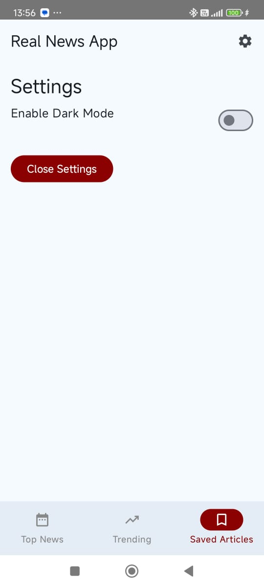
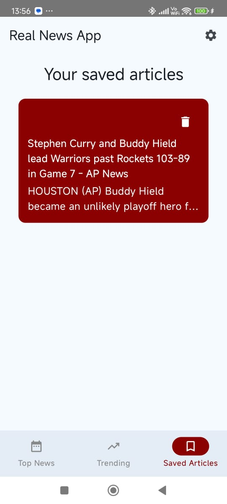
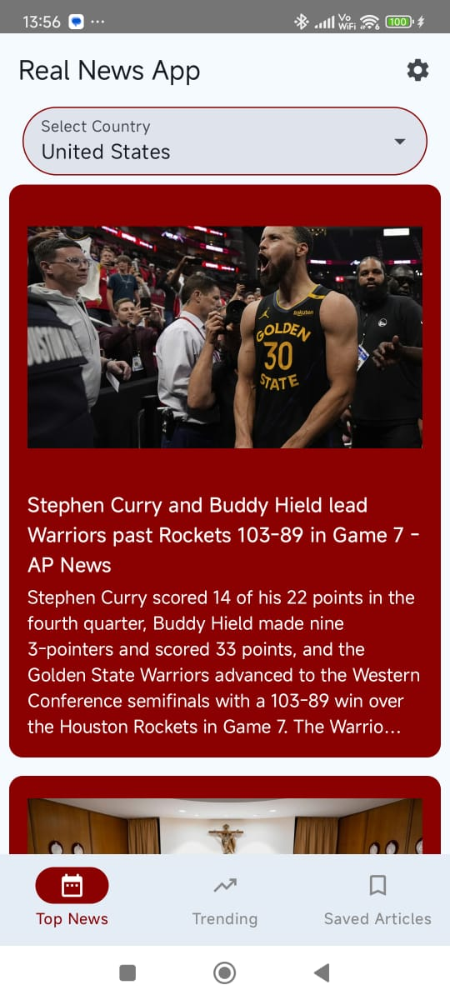

# Real News App

An Android news reading app built with **Jetpack Compose**, using modern Android development tools. The app fetches and displays news articles and offers user-friendly features such as:

- 📰 Reader Mode
- 🔊 Text-to-Speech (Listen to articles)
- 💾 Save Articles
- 🌐 Open Article in WebView

---

## Features

###  View News Articles
- Shows title, image, and content of selected news articles.

###  Reader Mode
- Enables a distraction-free reading experience with a warm background and enhanced typography.

###  Text-to-Speech
- Listen to articles with a single tap using Android's `TextToSpeech` API.
- Controls for start/stop listening.

###  Save Articles
- Save articles to local database using Room.
- Visually indicates if an article is saved.

###  WebView Integration
- View the original article in a WebView without leaving the app.

---

##  Tech Stack

- **Kotlin**
- **Jetpack Compose**
- **Room Database**
- **Material3**
- **TextToSpeech API**
- **Coil (Image loading)**
- **WebView**

---

##  Architecture

- **UI Layer:** Built using Jetpack Compose.
- **Data Layer:** Local persistence via Room.
- **State Management:** `remember`, `mutableStateOf`, and `LaunchedEffect`.

---

## 📸 Screenshots

<p align="center">
  
  
  
</p>

<p align="center">
  
</p>
---

## 📦 Installation

1. Clone this repository:
   ```bash
   git clone https://github.com/shashank-iiitdelhi/NewsApp.git
